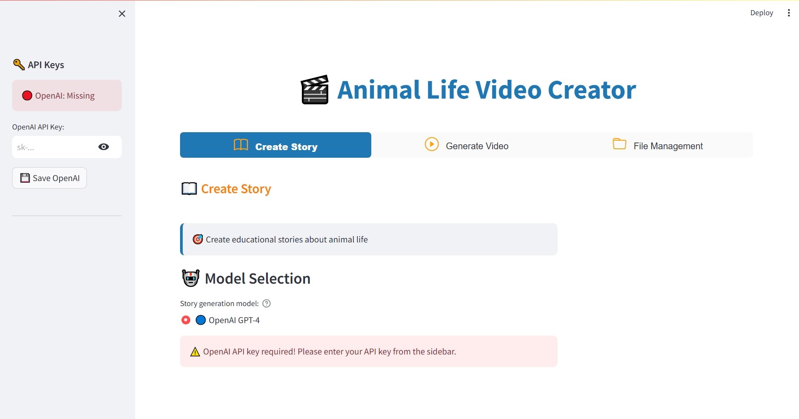

# Animal Life Animation Creator

This project is a Python application that creates educational animations about animal lives using OpenAI's API.

## Preview

*The web application interface showing the story creation and video generation features*

## Features

- Generate animal life stories
- Scene-by-scene narration and visual prompts
- Text-to-Speech voiceover
- Automatic video creation
- Story data in JSON format
- User-friendly web interface built with Streamlit

## Development

The project now uses OpenAI's DALL-E API for image generation and OpenAI TTS for audio generation. All components are fully integrated and functional.

### TODO

- [+] Convert the project into a web application (using streamlit) 
- [+] Implement a user-friendly interface for easy story creation
- [ ] Improve the prompt 
- [ ] Add more animal species to the story pool
- [ ] Add support for different models and implement user model selection
